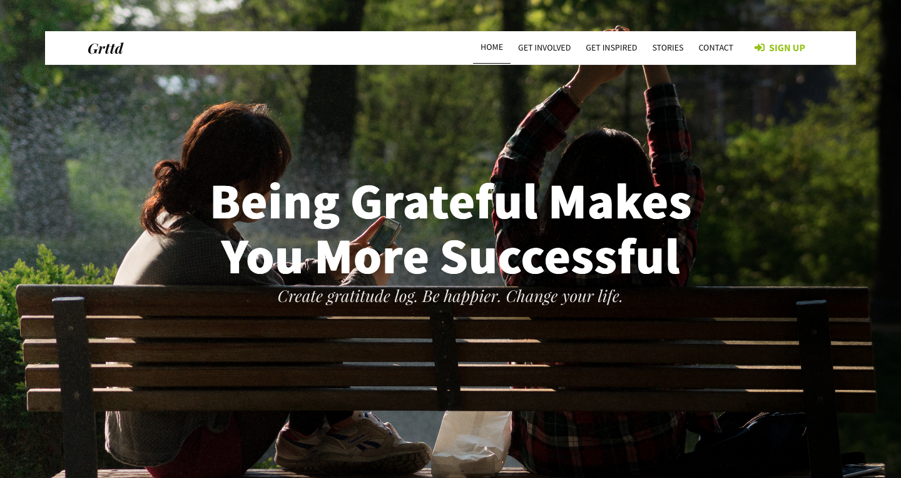

# Tutorial : Building a “Gratitude Log” Landing Page With [Bulma](https://bulma.io)

*April 2018*

In this tutorial I am going to run through the process of creating a *Gratitude Log* landing page as designed [by Tomas Laurinavicius.](https://webdesign.tutsplus.com/tutorials/design-an-elegant-gratitude-log-landing-page-with-photoshop--cms-22787).

To build this page, we will use :

* Tools : 
	* [Bulma](https://bulma.io)
	* [Normalize.css](http://necolas.github.io/normalize.css/)
* Pictures : 
	* [Chillin' in the sun](https://skitterphoto.com/photos/895/chilling-in-the-park)
	* Avatars from [User Inter Faces](http://uifaces.com)
* Fonts: 
	* [PT Serif](https://www.fontsquirrel.com/fonts/pt-serif)
	* [Playfair Display](https://www.fontsquirrel.com/fonts/playfair-display)
	* [Source Sans Pro](https://www.fontsquirrel.com/fonts/source-sans-pro)

## What's [Bulma](https://bulma.io) and why use it ?

Bulma is an open source CSS framework based on Flexbox and created by [Jeremy Thomas](https://jgthms.com/). I wanted to learn a new framework,  discover a new tool and I have no doubt it will improve my CSS skills. Bulma is an alternative to Bootstrap, Jeremy explain how [here](https://bulma.io/alternative-to-bootstrap/).

## Install [Bulma](https://bulma.io)

First, let's install Bulma. There are several ways to use Bulma. Here, I decided to install the Bulma's package with `npm` :
1. Open your terminal
1. Create a new folder
1. Initiate `npm`
1. Install `bulma`


```shell
	~/Web  mkdir Grttd
 	~/Web  cd Grttd
 	~/Web/Grttd  npm init
	~/Web/Grttd  npm install bulma
	npm notice created a lockfile as package-lock.json. You should commit this file.
	+ bulma@0.7.0
	added 1 package from 1 contributor in 2.019s
	 ~/Web/Grttd  ls
node_modules      package-lock.json package.json
```

## Install [normalize.css](https://necolas.github.io/normalize.css/)

```shell
	npm install normalize.css
```

`Normalize.css is a small CSS file that provides better cross-browser consistency in the default styling of HTML elements. It’s a modern, HTML5-ready, alternative to the traditional CSS reset.`

## Files and Folder structure

So far, here are the files and the folder structure :
* css/
	- grttdStyle.css
* img/
	- 128-2.jpg
	- 128-3.jpg
	- 128-4.jpg
	- 128-5.jpg
	- summerTime.jpg
* node_modules/
	- bulma/
	- normalize.css/
* index.html


Create the folders needed and already add the images.

## Let's dive into the code

Open up `index.html` and enter the following base HTML:

```html
	<!DOCTYPE html>
<html>
<head>
  <meta charset="utf-8">
  <meta name="viewport" content="width=device-width, initial-scale=1">
  <title>Gratitude Log</title>
  <link rel="stylesheet" href="node_modules/normalize.css/normalize.css">
  <link rel="stylesheet" href="node_modules/bulma/css/bulma.min.css">
  <script defer src="https://use.fontawesome.com/releases/v5.0.7/js/all.js"></script>
</head>
<body>
  <section class="section">
    <div class="container">
      <h1 class="title">
        Gratitude Log
      </h1>
      <p class="subtitle">
        My first website with <strong>Bulma</strong>!
      </p>
    </div>
  </section>
</body>
</html>
```

We have our first bit of code! Let's break it down. 

This code is based on starter template from Bulma. Really clean and short. The <head> section contains the necessary viewport tag so our media queries work correctly. I've linked the css files from the nodes folders and add a script to be able to use the icons from Font Awesome. 

The <body> element contains is almost empty for the moment. I will follow the process of Thomas for the rest of the page.

## Building the header area :

We want something approaching this :


I think that a good start is to use the [hero class](https://bulma.io/documentation/layout/hero/) from Bulma. With that in place, you just have to erase the useless html and make some CSS adjustment.
1. The html :

``` html
<section class="hero is-success is-fullheight">
    <!-- Hero head: will stick at the top -->
    <div class="hero-head">
      <header class="navbar">
        <div class="container">
          <div class="navbar-brand">
            <a class="navbar-item">
              <span class="grttd">Grttd</span>
            </a>
            <span class="navbar-burger burger" data-target="navbarMenuHeroC">
              <span></span>
              <span></span>
              <span></span>
            </span>
          </div>
          <div id="navbarMenuHeroC" class="navbar-menu">
            <div class="navbar-end">
              <a class="navbar-item is-active">Home</a>
              <a class="navbar-item">Get Involved</a>
              <a class="navbar-item">Get Inspired</a>
              <a class="navbar-item">Stories</a>
              <a class="navbar-item">Contact</a>
              <span class="navbar-item">
                <a class="button is-success is-inverted">
                  <span class="icon">
                    <i class="fas fa-sign-in-alt"></i>
                  </span>
                  <span>Sign up</span>
                </a>
              </span>
            </div>
          </div>
        </div>
      </header>
    </div>

    <!-- Hero content: will be in the middle -->
    <div class="hero-body">
      <div class="container has-text-centered">
        <h1 class="title">
          Being Grateful Makes<br>You More Successful
        </h1>
        <h2 class="subtitle">
          Create gratitude log. Be happier. Change your life.
        </h2>
      </div>
    </div>
  </section>
```

1. The css :

``` css
:root{
	--dark-grey : #0E0E0E;
	--green  	: #96c218;
}
/*! Generated by Font Squirrel (https://www.fontsquirrel.com) on April 18, 2018 */
@font-face {
    font-family: 'playfair_displaybold_italic';
    src: url('../fonts/playfairdisplay-bolditalic-webfont.woff2') format('woff2'),
         url('../fonts/playfairdisplay-bolditalic-webfont.woff') format('woff');
    font-weight: normal;
    font-style: normal;}
@font-face {
    font-family: 'source_sans_proregular';
    src: url('../fonts/sourcesanspro-regular-webfont.woff2') format('woff2'),
         url('../fonts/sourcesanspro-regular-webfont.woff') format('woff');
    font-weight: normal;
    font-style: normal;}
@font-face {
    font-family: 'playfair_displayitalic';
    src: url('../fonts/playfairdisplay-italic-webfont.woff2') format('woff2'),
         url('../fonts/playfairdisplay-italic-webfont.woff') format('woff');
    font-weight: normal;
    font-style: normal;}
@font-face {
    font-family: 'source_sans_probold';
    src: url('../fonts/sourcesanspro-bold-webfont.woff2') format('woff2'),
         url('../fonts/sourcesanspro-bold-webfont.woff') format('woff');
    font-weight: normal;
    font-style: normal;}
@font-face {
    font-family: 'pt_serifbold_italic';
    src: url('../fonts/ptf76f-webfont.woff2') format('woff2'),
         url('../fonts/ptf76f-webfont.woff') format('woff');
    font-weight: normal;
    font-style: normal;}
@font-face {
    font-family: 'source_sans_prosemibold';
    src: url('../fonts/sourcesanspro-semibold-webfont.woff2') format('woff2'),
         url('../fonts/sourcesanspro-semibold-webfont.woff') format('woff');
    font-weight: normal;
    font-style: normal;}
@font-face {
    font-family: 'playfair_displayblack';
    src: url('../fonts/playfairdisplay-black-webfont.woff2') format('woff2'),
         url('../fonts/playfairdisplay-black-webfont.woff') format('woff');
    font-weight: normal;
    font-style: normal;}
@font-face {
    font-family: 'pt_serifregular';
    src: url('../fonts/ptf55f-webfont.woff2') format('woff2'),
         url('../fonts/ptf55f-webfont.woff') format('woff');
    font-weight: normal;
    font-style: normal;}
.hero.is-success{
	background-color: transparent;
	border: none;
	position: relative;}
.hero-head{
	position: absolute;
	top: 50px;
	width: 90%;
	background-color: #fff;
	align-self: center;}
.hero.is-success a:not(.button):not(.dropdown-item):not(.tag),
.navbar-burger{
	color: var(--dark-grey);}
.navbar-item{
	font-family: 'source_sans_proregular', sans-serif;
	font-size: 0.875em;
	text-transform: uppercase;}
.hero.is-success a.navbar-item.is-active,
.hero.is-success a.navbar-item:hover{
	background-color: transparent;
	border-bottom: 1px solid var(--dark-grey);}
span.grttd{
	font-family: 'playfair_displaybold_italic', serif;
	font-size: 1.625em;
	text-transform: none;}
.button.is-success.is-inverted{
	color: var(--green);}
.button{
	border-radius: 0;
	font-family: 'source_sans_probold', serif;}
/* Add the picture and made it take all the place */
.hero-body{
	background:url(../img/summerTime.jpg) no-repeat center center;
	background-size: cover;}
h1.title{
	font-family: 'source_sans_probold', serif;
	font-size: 5em;
	line-height: 1.1em;}
h2.subtitle{
	font-family: 'playfair_displayitalic', serif;
	font-size: 1.625em;
	line-height: 1.1em;
}
```

This code allows us to arrive to this :


Now, let's focus on the example of a gratitude log on the button.

```html

<div class="card">
            <div class="card-content">
              <div class="media">
                  <div class="media-left">
                    <figure class="image is-64x64">
                        
                    </figure>
                    <span class="streak">12</span>
                  </div>
                  <div class="media-content">
                    <p class="title is-4">John Smith</p>
                    <p class="subtitle is-6">12 grateful days streak</p>
                  </div>
              </div>
          </div>
            </div>
            
            <a class="button is-info is-inverted is-large">
              <span>Start Living</span>
              <span class="icon"><i class="fas fa-arrow-right"></i></span>
            </a>
      </div>
```


```css
.button.is-info.is-inverted{
	color: var(--dark-grey);
	text-transform: uppercase;
	font-family: 'source_sans_prosemibold',serif;
	font-size: 1em;
	letter-spacing: 0.2em;
	padding: 1em 2em;}
.button.is-info.is-inverted:hover{
	background-color: var(--green);
	color: var(--white)}
/* Gratitude Log Example*/
.card{
	background-color: transparent;
	box-shadow: 0 0 transparent;}
.media-left{
	position: relative;}
img{
	border-radius: 50%;}
.streak{
	font-family: 'source_sans_probold', sans-serif;
	background-color: var(--green);
	border-radius: 50%;
	padding: 0.25em;
	color: var(--white);
	position: absolute;
	font-size: 0.85em;
	left: 45px;
	top: -5px;
    line-height: normal;}
.media{
	justify-content: center;}
.media-content{
	flex-grow: 0;}
.media-content > .title{
	font-family: 'pt_serifregular', serif;}
.media-content > .subtitle{
	font-family: 'source_sans_proregular', serif;
}
```
